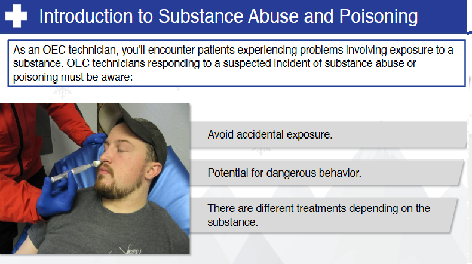

# Nsp Oec Training Chapter 12 - National Ski Patrol - Outdoor Emergency Care chapter 12
National Ski Patrol - Outdoor Emergency Care chapter 12

## Chapter 12: Substance Abuse & Poisoning

1. List and describe the four ways a drug enters and moves through the body.
2. List the four routes of absorption.
3. List and describe several commonly abused substances.
4. List the signs and symptoms associated with commonly abused substances and with common poisonings.
5. Describe and demonstrate the proper care of a patient who has abused a substance or been poisoned.
6. List and describe two emergency sources for poison-related or chemical-related information. 
7. Define SLUDGEM and DUMBELS in the context of poisoning.

## 12.1: List and describe the four ways a drug enters and moves through the body.

The process by which a drug enters and moves through the body is known as **pharmacokinetics** and is commonly described by four stages: **absorption**, **distribution**, **metabolism**, and **excretion**. These stages determine how quickly and efficiently a drug works, how long it lasts, and how it is ultimately cleared from the body.

### 1. **Absorption**
   - **Definition**: Absorption refers to the process by which a drug enters the bloodstream from its site of administration (e.g., oral, intravenous, intramuscular, transdermal). For a drug to be effective, it must be absorbed into the bloodstream, except in cases of local administration (e.g., topical treatments).
   - **Factors affecting absorption**: The **route of administration**, the **drug formulation**, and **physiological factors** (like pH and gastrointestinal function) all play a role in absorption. For example, oral drugs must pass through the stomach and intestines before entering the bloodstream, which can delay absorption.
   - **Example**: A medication taken orally must dissolve in the stomach and be absorbed in the intestines before it reaches the bloodstream.

### 2. **Distribution**
   - **Definition**: Once a drug is absorbed into the bloodstream, it is distributed throughout the body to tissues and organs. The drug must reach its target tissues to exert its intended effects.
   - **Factors affecting distribution**: Blood flow to tissues, the **drug's solubility**, its ability to bind to plasma proteins, and the presence of barriers (e.g., the **blood-brain barrier**) determine how a drug is distributed. Drugs that are more lipid-soluble or unbound to proteins tend to distribute more widely.
   - **Example**: A drug that crosses the blood-brain barrier will affect the central nervous system, like some sedatives or painkillers.

### 3. **Metabolism**
   - **Definition**: Metabolism refers to the chemical alteration of a drug, typically in the **liver**, to make it easier for the body to excrete. This process can transform active drugs into inactive forms or convert prodrugs (inactive forms) into active forms.
   - **Factors affecting metabolism**: The **liver enzymes** involved in metabolism (such as the **cytochrome P450 enzymes**) are a major factor. Additionally, age, genetic factors, liver function, and interactions with other drugs can influence how quickly a drug is metabolized.
   - **Example**: Many drugs are metabolized in the liver to more water-soluble compounds, which are easier to excrete via the kidneys.

### 4. **Excretion**
   - **Definition**: Excretion is the process by which the body eliminates the drug or its metabolites, primarily through the **kidneys (urine)** but also through the **liver (bile)**, **lungs (exhaled air)**, or **skin (sweat)**.
   - **Factors affecting excretion**: Kidney function, hydration status, and the drug's chemical properties affect how efficiently it is excreted. Drugs that are not properly metabolized or excreted may accumulate in the body, leading to toxicity.
   - **Example**: Most medications are filtered by the kidneys and excreted in the urine. Drugs like antibiotics and some blood pressure medications are eliminated this way.

In summary, a drug’s journey through the body—absorption, distribution, metabolism, and excretion—determines how it exerts its effects and is ultimately cleared. Understanding these stages helps in optimizing drug therapy and managing drug interactions and side effects. 

Sources:
- [Mayo Clinic on pharmacokinetics](https://www.mayoclinic.org/)
- [Pharmacokinetics overview - PubMed](https://pubmed.ncbi.nlm.nih.gov)

## 12.2: List the four routes of absorption.

The **four main routes of absorption** refer to the different ways drugs enter the body and are absorbed into the bloodstream. Each route has its unique characteristics, advantages, and challenges:

### 1. **Oral (Enteral) Absorption**
   - **Definition**: Drugs are taken by mouth and absorbed through the digestive tract.
   - **Characteristics**: This is the most common route of administration. The drug passes through the stomach and intestines, where it is absorbed into the bloodstream.
   - **Example**: Tablets, capsules, and liquid medications.

### 2. **Intravenous (IV) Absorption**
   - **Definition**: Drugs are directly injected into the bloodstream.
   - **Characteristics**: This route bypasses the absorption process since the drug is delivered directly into the circulatory system, leading to **immediate** and **complete absorption**.
   - **Example**: IV fluids, chemotherapy drugs, antibiotics.

### 3. **Inhalation Absorption**
   - **Definition**: Drugs are absorbed via the lungs when inhaled as a gas or aerosol.
   - **Characteristics**: This route provides rapid absorption due to the large surface area of the alveoli in the lungs and the rich blood supply.
   - **Example**: Inhalers for asthma (e.g., albuterol) or anesthetic gases.

### 4. **Topical/Transdermal Absorption**
   - **Definition**: Drugs are applied to the skin and absorbed into the bloodstream through the skin layers.
   - **Characteristics**: Absorption through the skin is generally slower and provides a **sustained release** of the medication.
   - **Example**: Patches (e.g., nicotine patches), ointments, and creams.

These routes determine how quickly and effectively a drug is absorbed and used by the body, and the choice of route often depends on the specific drug and the condition being treated.

Sources:
- Mayo Clinic: [Drug Absorption](https://www.mayoclinic.org)
- PubMed: [Routes of Drug Administration](https://pubmed.ncbi.nlm.nih.gov)

## 12.3: List and describe several commonly abused substances.

Here is a list and description of several **commonly abused substances**, which can lead to addiction, health problems, and social or legal consequences:

### 1. **Alcohol**
   - **Description**: Alcohol is a legal, widely consumed depressant that affects the central nervous system. While moderate drinking may not pose harm for most adults, excessive or binge drinking can lead to dependence and addiction, known as **alcoholism**.
   - **Effects**: Impaired judgment, motor coordination, slurred speech, and slowed reaction times. Long-term abuse can result in liver disease, cardiovascular issues, and cognitive impairments.
   - **Risks**: Alcohol poisoning, accidents, liver cirrhosis, and withdrawal symptoms like delirium tremens (DTs).
   - **Source**: [National Institute on Alcohol Abuse and Alcoholism (NIAAA)](https://www.niaaa.nih.gov/)

### 2. **Opioids**
   - **Description**: Opioids are a class of drugs that include prescription painkillers (e.g., oxycodone, hydrocodone) and illicit substances like **heroin**. They are used medically for pain relief but are highly addictive.
   - **Effects**: Euphoria, pain relief, drowsiness, and slowed breathing. Long-term use can lead to tolerance, physical dependence, and addiction.
   - **Risks**: Overdose due to respiratory depression, physical dependence, and withdrawal symptoms. Fentanyl, a synthetic opioid, is particularly dangerous due to its potency.
   - **Source**: [Centers for Disease Control and Prevention (CDC)](https://www.cdc.gov/drugoverdose/opioids/index.html)

### 3. **Cocaine**
   - **Description**: Cocaine is a powerful stimulant drug derived from the coca plant. It is typically snorted, smoked (as crack cocaine), or injected and is known for its intense, short-lived euphoric effects.
   - **Effects**: Increased energy, euphoria, heightened alertness, and talkativeness. It can also increase heart rate, blood pressure, and body temperature.
   - **Risks**: High risk of addiction, cardiovascular issues like heart attacks or strokes, and mental health problems, including paranoia and anxiety.
   - **Source**: [National Institute on Drug Abuse (NIDA)](https://www.drugabuse.gov/publications/research-reports/cocaine/what-cocaine)

### 4. **Methamphetamine (Meth)**
   - **Description**: Methamphetamine is a highly addictive stimulant that affects the central nervous system. It is available in powder or crystal form (crystal meth) and is often smoked, snorted, or injected.
   - **Effects**: Increased energy, euphoria, and alertness, along with a significant "rush" when smoked or injected. Long-term use can lead to severe dental issues ("meth mouth"), skin sores, and significant weight loss.
   - **Risks**: Addiction, cognitive impairments, anxiety, paranoia, and violent behavior. Chronic use can result in permanent brain damage.
   - **Source**: [Substance Abuse and Mental Health Services Administration (SAMHSA)](https://www.samhsa.gov/methamphetamine)

### 5. **Marijuana (Cannabis)**
   - **Description**: Marijuana is a psychoactive drug derived from the cannabis plant. While increasingly legalized for medical and recreational use, marijuana can be abused, particularly when used in high doses or by adolescents.
   - **Effects**: Euphoria, altered senses, relaxation, and impaired short-term memory. High doses can cause anxiety, paranoia, and hallucinations.
   - **Risks**: Long-term heavy use may lead to cognitive impairments, respiratory issues (if smoked), and mental health disorders like anxiety or depression.
   - **Source**: [National Institute on Drug Abuse (NIDA)](https://www.drugabuse.gov/publications/drugfacts/marijuana)

### 6. **Benzodiazepines**
   - **Description**: Benzodiazepines (e.g., Valium, Xanax) are sedatives prescribed for anxiety, insomnia, and other conditions. They are commonly abused due to their calming effects and are highly addictive when misused.
   - **Effects**: Sedation, relaxation, and reduced anxiety. They also impair memory and motor coordination.
   - **Risks**: Tolerance, dependence, overdose (especially when combined with alcohol or opioids), and severe withdrawal symptoms (e.g., seizures).
   - **Source**: [FDA on Benzodiazepine Risks](https://www.fda.gov/drugs/postmarket-drug-safety-information-patients-and-providers/fda-requires-labeling-changes-benzodiazepine-drugs)

### 7. **Hallucinogens (LSD, Psilocybin, PCP)**
   - **Description**: Hallucinogens like **LSD**, **psilocybin** (magic mushrooms), and **PCP** alter perception, mood, and thought processes. They are used recreationally for their mind-altering effects.
   - **Effects**: Visual and auditory hallucinations, altered sense of time, and euphoria. PCP can cause feelings of detachment from reality.
   - **Risks**: "Bad trips" can cause panic, paranoia, or dangerous behavior. Long-term use can lead to persistent psychosis or hallucinogen persisting perception disorder (HPPD).
   - **Source**: [National Institute on Drug Abuse (NIDA)](https://www.drugabuse.gov/publications/research-reports/hallucinogens-dissociative-drugs/what-are-hallucinogens)

These substances can have devastating effects on both physical and mental health, and addressing substance abuse early can help prevent addiction and long-term damage. If you or someone you know is struggling with substance abuse, seeking professional help is essential.

## 12.4: List the signs and symptoms associated with commonly abused substances and with common poisonings.

Here is a list of the **signs and symptoms** associated with **commonly abused substances** and **common poisonings**:

---

### **Signs and Symptoms of Commonly Abused Substances**

1. **Alcohol**:
   - **Early Symptoms**: Euphoria, reduced inhibition, impaired judgment, slurred speech, and drowsiness.
   - **Advanced Symptoms**: Memory blackouts, loss of motor coordination, vomiting, and severe intoxication leading to unconsciousness.
   - **Chronic Abuse Symptoms**: Liver disease, heart problems, cognitive impairment, and withdrawal symptoms (e.g., tremors, anxiety, seizures).

2. **Opioids (e.g., heroin, fentanyl, prescription painkillers)**:
   - **Symptoms**: Euphoria, drowsiness, confusion, slowed breathing, pinpoint pupils, nausea, and constipation.
   - **Overdose Signs**: Respiratory depression, loss of consciousness, cyanosis (blue skin), and potential death without intervention (e.g., naloxone administration).

3. **Cocaine**:
   - **Symptoms**: Increased energy, euphoria, heightened alertness, dilated pupils, increased heart rate and blood pressure, restlessness, and irritability.
   - **Chronic Use**: Nasal septum damage (if snorted), weight loss, paranoia, and heart issues like arrhythmias.
   - **Overdose Signs**: Hyperthermia, seizures, stroke, heart attack, and agitation.

4. **Methamphetamine (Meth)**:
   - **Symptoms**: Increased physical activity, rapid speech, euphoria, anxiety, and repetitive behaviors.
   - **Chronic Use**: "Meth mouth" (severe dental problems), weight loss, skin sores, paranoia, and hallucinations.
   - **Overdose Signs**: Severe agitation, violent behavior, hyperthermia, stroke, and heart failure.

5. **Marijuana**:
   - **Symptoms**: Euphoria, altered perception, relaxation, increased appetite, dry mouth, red eyes, and impaired memory and motor skills.
   - **Chronic Use**: Cognitive impairments, respiratory issues (if smoked), and anxiety or paranoia in some users.

6. **Benzodiazepines (e.g., Xanax, Valium)**:
   - **Symptoms**: Drowsiness, confusion, dizziness, muscle weakness, impaired coordination, and blurred vision.
   - **Overdose Signs**: Extreme drowsiness, confusion, respiratory depression, and potential coma, especially when combined with alcohol or opioids.
   - **Withdrawal Symptoms**: Anxiety, insomnia, seizures, and tremors.

7. **Hallucinogens (LSD, Psilocybin, PCP)**:
   - **Symptoms**: Visual or auditory hallucinations, altered perception of time, intense emotions, and confusion.
   - **"Bad Trip" Symptoms**: Anxiety, panic, paranoia, aggressive behavior, and psychosis (particularly with PCP).

---

### **Signs and Symptoms of Common Poisonings**

1. **Carbon Monoxide Poisoning**:
   - **Symptoms**: Headache, dizziness, weakness, nausea, vomiting, confusion, and shortness of breath.
   - **Severe Symptoms**: Loss of consciousness, seizures, and death if not treated promptly (via oxygen therapy).

2. **Food Poisoning (e.g., Salmonella, E. coli)**:
   - **Symptoms**: Nausea, vomiting, diarrhea, abdominal cramps, and fever.
   - **Severe Symptoms**: Dehydration, bloody diarrhea, and kidney failure in severe cases (e.g., E. coli).

3. **Pesticide Poisoning**:
   - **Symptoms**: Nausea, vomiting, abdominal pain, dizziness, sweating, blurred vision, and muscle twitching.
   - **Severe Symptoms**: Seizures, respiratory depression, coma, and potential death without medical intervention.

4. **Household Cleaner Poisoning (e.g., bleach, ammonia)**:
   - **Symptoms**: Irritation of the mouth, throat, and eyes, difficulty breathing, coughing, nausea, and vomiting.
   - **Severe Symptoms**: Burns to the esophagus or stomach lining, respiratory distress, and chemical pneumonitis if inhaled or ingested in large quantities.

5. **Heavy Metal Poisoning (e.g., lead, mercury)**:
   - **Symptoms of Lead Poisoning**: Developmental delays in children, irritability, abdominal pain, and weight loss.
   - **Symptoms of Mercury Poisoning**: Tremors, memory problems, mood swings, and muscle weakness.

6. **Antifreeze (Ethylene Glycol) Poisoning**:
   - **Symptoms**: Intoxication, vomiting, drowsiness, rapid breathing, and kidney failure.
   - **Severe Symptoms**: Seizures, coma, and death if untreated. Early medical intervention is critical (e.g., administration of ethanol or fomepizole).

---

### **Conclusion**:
Commonly abused substances and poisons can have devastating effects on both physical and mental health. Recognizing the signs and symptoms early can lead to prompt treatment and, in many cases, save lives. For substance abuse or poisoning emergencies, contact emergency services or a poison control center immediately.

Sources:
- [CDC: Opioid Overdose Symptoms](https://www.cdc.gov/drugoverdose/prevention/index.html)
- [NIDA: Commonly Abused Drugs Chart](https://www.drugabuse.gov/drug-topics/commonly-used-drugs-charts)
- [Mayo Clinic: Carbon Monoxide Poisoning](https://www.mayoclinic.org/diseases-conditions/carbon-monoxide/symptoms-causes/syc-20370642)

## 12.5: Here is a list of the **signs and symptoms** associated with **commonly abused substances** and **common poisonings**:

---

### **Signs and Symptoms of Commonly Abused Substances**

1. **Alcohol**:
   - **Early Symptoms**: Euphoria, reduced inhibition, impaired judgment, slurred speech, and drowsiness.
   - **Advanced Symptoms**: Memory blackouts, loss of motor coordination, vomiting, and severe intoxication leading to unconsciousness.
   - **Chronic Abuse Symptoms**: Liver disease, heart problems, cognitive impairment, and withdrawal symptoms (e.g., tremors, anxiety, seizures).

2. **Opioids (e.g., heroin, fentanyl, prescription painkillers)**:
   - **Symptoms**: Euphoria, drowsiness, confusion, slowed breathing, pinpoint pupils, nausea, and constipation.
   - **Overdose Signs**: Respiratory depression, loss of consciousness, cyanosis (blue skin), and potential death without intervention (e.g., naloxone administration).

3. **Cocaine**:
   - **Symptoms**: Increased energy, euphoria, heightened alertness, dilated pupils, increased heart rate and blood pressure, restlessness, and irritability.
   - **Chronic Use**: Nasal septum damage (if snorted), weight loss, paranoia, and heart issues like arrhythmias.
   - **Overdose Signs**: Hyperthermia, seizures, stroke, heart attack, and agitation.

4. **Methamphetamine (Meth)**:
   - **Symptoms**: Increased physical activity, rapid speech, euphoria, anxiety, and repetitive behaviors.
   - **Chronic Use**: "Meth mouth" (severe dental problems), weight loss, skin sores, paranoia, and hallucinations.
   - **Overdose Signs**: Severe agitation, violent behavior, hyperthermia, stroke, and heart failure.

5. **Marijuana**:
   - **Symptoms**: Euphoria, altered perception, relaxation, increased appetite, dry mouth, red eyes, and impaired memory and motor skills.
   - **Chronic Use**: Cognitive impairments, respiratory issues (if smoked), and anxiety or paranoia in some users.

6. **Benzodiazepines (e.g., Xanax, Valium)**:
   - **Symptoms**: Drowsiness, confusion, dizziness, muscle weakness, impaired coordination, and blurred vision.
   - **Overdose Signs**: Extreme drowsiness, confusion, respiratory depression, and potential coma, especially when combined with alcohol or opioids.
   - **Withdrawal Symptoms**: Anxiety, insomnia, seizures, and tremors.

7. **Hallucinogens (LSD, Psilocybin, PCP)**:
   - **Symptoms**: Visual or auditory hallucinations, altered perception of time, intense emotions, and confusion.
   - **"Bad Trip" Symptoms**: Anxiety, panic, paranoia, aggressive behavior, and psychosis (particularly with PCP).

---

### **Signs and Symptoms of Common Poisonings**

1. **Carbon Monoxide Poisoning**:
   - **Symptoms**: Headache, dizziness, weakness, nausea, vomiting, confusion, and shortness of breath.
   - **Severe Symptoms**: Loss of consciousness, seizures, and death if not treated promptly (via oxygen therapy).

2. **Food Poisoning (e.g., Salmonella, E. coli)**:
   - **Symptoms**: Nausea, vomiting, diarrhea, abdominal cramps, and fever.
   - **Severe Symptoms**: Dehydration, bloody diarrhea, and kidney failure in severe cases (e.g., E. coli).

3. **Pesticide Poisoning**:
   - **Symptoms**: Nausea, vomiting, abdominal pain, dizziness, sweating, blurred vision, and muscle twitching.
   - **Severe Symptoms**: Seizures, respiratory depression, coma, and potential death without medical intervention.

4. **Household Cleaner Poisoning (e.g., bleach, ammonia)**:
   - **Symptoms**: Irritation of the mouth, throat, and eyes, difficulty breathing, coughing, nausea, and vomiting.
   - **Severe Symptoms**: Burns to the esophagus or stomach lining, respiratory distress, and chemical pneumonitis if inhaled or ingested in large quantities.

5. **Heavy Metal Poisoning (e.g., lead, mercury)**:
   - **Symptoms of Lead Poisoning**: Developmental delays in children, irritability, abdominal pain, and weight loss.
   - **Symptoms of Mercury Poisoning**: Tremors, memory problems, mood swings, and muscle weakness.

6. **Antifreeze (Ethylene Glycol) Poisoning**:
   - **Symptoms**: Intoxication, vomiting, drowsiness, rapid breathing, and kidney failure.
   - **Severe Symptoms**: Seizures, coma, and death if untreated. Early medical intervention is critical (e.g., administration of ethanol or fomepizole).

---

### **Conclusion**:
Commonly abused substances and poisons can have devastating effects on both physical and mental health. Recognizing the signs and symptoms early can lead to prompt treatment and, in many cases, save lives. For substance abuse or poisoning emergencies, contact emergency services or a poison control center immediately.

Sources:
- [CDC: Opioid Overdose Symptoms](https://www.cdc.gov/drugoverdose/prevention/index.html)
- [NIDA: Commonly Abused Drugs Chart](https://www.drugabuse.gov/drug-topics/commonly-used-drugs-charts)
- [Mayo Clinic: Carbon Monoxide Poisoning](https://www.mayoclinic.org/diseases-conditions/carbon-monoxide/symptoms-causes/syc-20370642)

## 12.6: List and describe two emergency sources for poison-related or chemical-related information. 

Here are two emergency sources for poison-related or chemical-related information:

### 1. **Poison Control Centers (U.S. National Poison Hotline)**
   - **Description**: The U.S. **Poison Control Centers** provide 24/7 free and confidential expert advice for poisoning emergencies. They offer immediate assistance and information for suspected poisoning cases, including chemical exposure, drug overdose, household product ingestion, and bites or stings.
   - **Access**: 
     - **Hotline**: 1-800-222-1222
     - **Website**: [Poison Control](https://www.poison.org)
   - **Services**: The hotline connects callers with poison experts (toxicologists, pharmacists, nurses) who provide guidance on what actions to take in the event of poisoning or exposure to chemicals. They can assist with first aid instructions and recommend when to seek emergency medical care.

### 2. **Centers for Disease Control and Prevention (CDC) Chemical Emergency Guidelines**
   - **Description**: The **CDC** offers resources and guidelines for handling chemical-related emergencies, including exposure to toxic substances. The CDC's **Agency for Toxic Substances and Disease Registry (ATSDR)** provides critical information about chemical hazards, safety protocols, and public health interventions.
   - **Access**: 
     - **Website**: [CDC Chemical Emergencies](https://www.cdc.gov/niosh/topics/emres/chemagent.html)
   - **Services**: The CDC provides detailed fact sheets on various chemicals, emergency response guidelines, and exposure management strategies. The ATSDR's **ToxFAQs** offer quick access to information on chemical substances and their effects on human health.

Both sources provide essential, accessible information for anyone dealing with a potential poisoning or chemical exposure.

## 12.7: Define SLUDGEM and DUMBELS in the context of poisoning.

**SLUDGEM** and **DUMBELS** are two mnemonics used by healthcare providers and emergency responders to remember the signs and symptoms of **cholinergic poisoning**, which can occur from exposure to organophosphates, certain chemical warfare agents (e.g., sarin gas), and pesticides that inhibit acetylcholinesterase, leading to excessive stimulation of the parasympathetic nervous system.

### **SLUDGEM**:

This mnemonic is used to describe the **muscarinic** effects of cholinergic poisoning.

1. **S** – **Salivation**: Excessive production of saliva.
2. **L** – **Lacrimation**: Excessive tearing or watery eyes.
3. **U** – **Urination**: Involuntary or frequent urination.
4. **D** – **Defecation/Diarrhea**: Involuntary bowel movements or diarrhea.
5. **G** – **Gastrointestinal upset**: Abdominal cramping, nausea, or vomiting.
6. **E** – **Emesis**: Vomiting.
7. **M** – **Miosis**: Pinpoint pupils (constricted pupils), a classic sign of organophosphate or nerve agent exposure.

### **DUMBELS**:

This mnemonic is used similarly to describe the **muscarinic** and some **nicotinic** effects of cholinergic poisoning.

1. **D** – **Defecation/Diarrhea**: Involuntary bowel movements or diarrhea.
2. **U** – **Urination**: Involuntary or frequent urination.
3. **M** – **Miosis**: Pinpoint pupils (constricted pupils).
4. **B** – **Bradycardia**: Abnormally slow heart rate.
5. **E** – **Emesis**: Vomiting.
6. **L** – **Lacrimation**: Excessive tearing.
7. **S** – **Salivation**: Excessive production of saliva, leading to drooling.

### **Application**:
These mnemonics are crucial for identifying **organophosphate poisoning** or **nerve agent exposure**, which require urgent medical intervention, typically including the use of **atropine** (an anticholinergic agent) and **pralidoxime** (to reactivate acetylcholinesterase). Early recognition of these symptoms helps guide rapid treatment to prevent respiratory failure and other life-threatening complications.

### Sources:
- National Institutes of Health (NIH): [Cholinergic Toxicity Overview](https://pubmed.ncbi.nlm.nih.gov/15783631/)
- CDC: [Emergency Response to Chemical Poisons](https://www.cdc.gov/niosh/topics/emres/chemagent.html)

## Key Terms 
 1. **Absorption** - The process by which toxins or chemicals enter the body through the skin, lungs, or digestive system. 
 ## Key Terms 
 1. **Absorption** - The process by which toxins or chemicals enter the body through the skin, lungs, or digestive system. 
  2. **Dermal Poisons** - Toxins that enter the body through the skin, causing localized or systemic effects. 
  3. **Designer Drugs** - Synthetic drugs created to mimic the effects of controlled substances, often with unpredictable and dangerous side effects. 
  4. **Ingested Poisons** - Toxins that enter the body through swallowing and can cause harm to the digestive system and other organs. 
  5. **Inhaled Poisons** - Toxins that are breathed into the lungs, potentially causing respiratory damage and systemic effects. 
  6. **Injected Poisons** - Toxins introduced into the body via injection, often leading to rapid systemic effects. 
  7. **Opioids** - A class of drugs, including both legal prescription painkillers and illegal drugs like heroin, that can cause respiratory depression, overdose, and death. 
  8. **Poison** - Any substance that can cause harm or death when introduced into the body in sufficient quantities. 
  9. **Substance Abuse** - The misuse of drugs or alcohol, leading to health, social, or legal consequences. 
  10. **Toxicological Event** - An incident involving exposure to toxic substances, leading to acute or chronic health effects. 
  11. **Toxin** - A harmful substance produced by living organisms, such as bacteria, plants, or animals. 
  12. **Withdrawal** - A group of symptoms that occur when a person who is dependent on a substance suddenly reduces or stops its use. 
 

## Getting Started
To get started with the **Nsp Oec Training Chapter 12** solution repository, follow these steps:
1. Clone the repository to your local machine.
2. Install the required dependencies listed at the top of the notebook.
3. Explore the example code provided in the repository and experiment.
4. Run the notebook and make it your own - **EASY !**
    
## Solution Features
- Easy to understand and use  
- Easily Configurable 
- Quickly start your project with pre-built templates
- Its Fast and Automated

## Notebook Features
- **Self Documenting** - Automatically identifes major steps in notebook 
- **Self Testing** - Unit Testing for each function
- **Easily Configurable** - Easily modify with **config.INI** - keyname value pairs
- **Includes Talking Code** - The code explains itself 
- **Self Logging** - Enhanced python standard logging   
- **Self Debugging** - Enhanced python standard debugging
- **Low Code** - or - No Code  - Most solutions are under 50 lines of code
- **Educational** - Includes educational dialogue and background material
    
## Deliverables or Figures
                      
    

## Github    https://github.com/JoeEberle/ 
## Email  josepheberle@outlook.com 

    

    